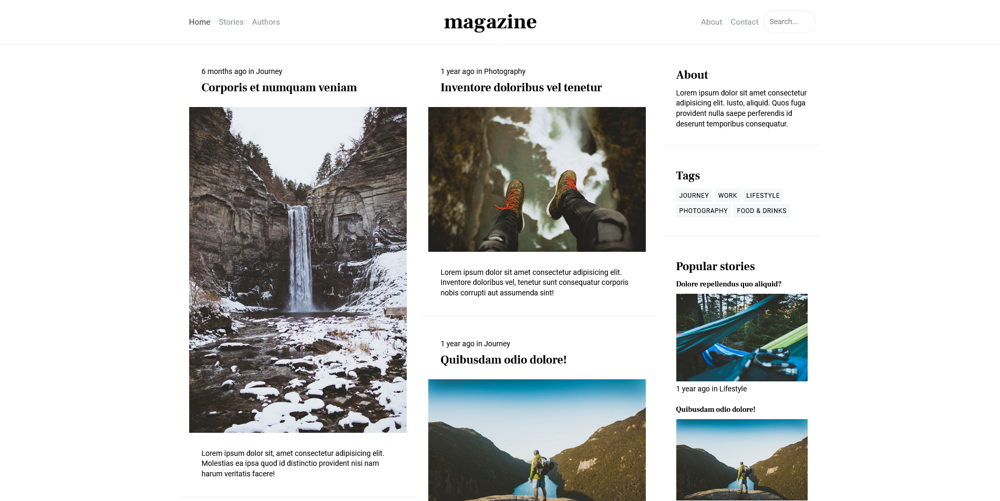
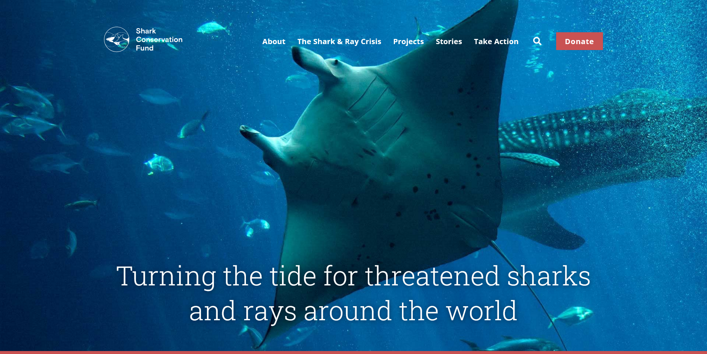
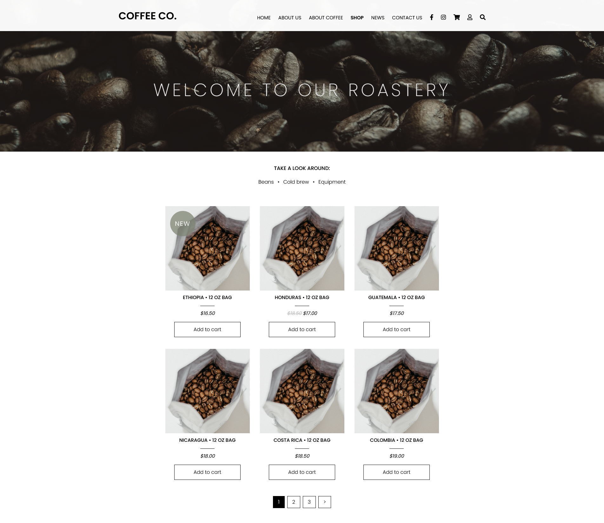

This is my first solo project completed during the front-end bootcamp at InfoShare Academy.

The task was to recreate 3 selected responsive layouts using HTML and CSS.

Layout 1 – magazine/blog:

- [Recreated layout](https://double-vee.github.io/bootcamp-project-1/layout1/index.html)

- [Reference](https://milo.bootlab.io/home-twocolumn.html)

Layout 2 – shark conservation fund page:

- [Recreated layout](https://double-vee.github.io/bootcamp-project-1/layout2/index.html)

- [Reference](https://www.sharkconservationfund.org/)

Layout 3 – coffee store:

- [Recreated layout](https://double-vee.github.io/bootcamp-project-1/layout3/index.html)

- [Reference](https://dworzysk.pl/sklep/)
